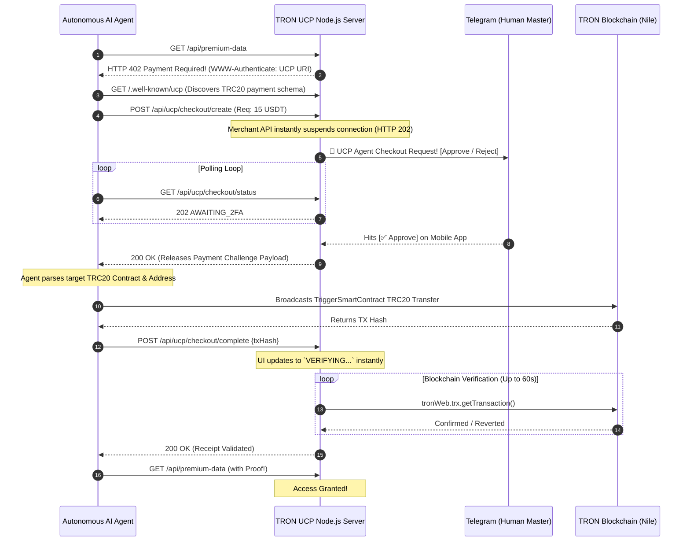

# TRON UCP Gateway: Autonomous Agent Payments with Human Control

## The Vision
In a future dominated by AI, autonomous agents will need to transact online—interacting with gated APIs, purchasing data, or acquiring resources purely machine-to-machine. **But how do we give AI agents the freedom to navigate financial mechanics without relinquishing human oversight and risking our wallets?**

**TRON UCP Gateway** is the answer. It is a production-grade merchant gateway built on the **TRON Nile Testnet** that implements the Universal Commerce Protocol (UCP). It seamlessly bridges autonomous bot workflows with human-centric security by bringing Stripe-like checkout routing to machine-to-machine `HTTP 402` paywalls.

The gateway introduces a **Human-In-The-Loop (HITL) 2FA** model where agents negotiate costs instantly over standardized UCP parameters, but the final cryptographic execution is paused to await out-of-band Telegram approval by their Human supervisor.

---

## How It Works

### Flow Architecture

The protocol adheres to a strict standardized lifecycle. The gateway actively blocks unauthorized agent requests and redirects them toward an automated checkout logic.



---

## Core Components Explored

### 1. The HTTP 402 Paywall Gater
Endpoints requiring compensation are gated with the traditionally unused `HTTP 402 Payment Required` standard. When an AI hits this, the frontend doesn't return an HTML checkout page—it returns a machine-readable `WWW-Authenticate` header outlining the routing path for the Universal Commerce Protocol manifest (`/.well-known/ucp`).

### 2. TRC20 Smart-Contract Integration
Rather than relying solely on abstract intents, the protocol communicates exactly what blockchain (TRON Nile Testnet), token standard (TRC20 USDT), network addresses, and denomination the agent must compile into its transaction. 

### 3. Telegram Human-In-The-Loop (HITL) Firewall
The cornerstone of our security module. When an AI initiates a checkout challenge, the checkout gets instantly suspended—intercepting the node response with a `202 AWAITING` status. Simultaneously, a webhook hits a Telegram bot which pings the human supervisor's mobile device.
**Only when the human cryptographically taps "Approve" does the payload get unlocked for the Agent to sign.** It entirely mitigates the "runaway LLM draining a wallet" threat vector.

### 4. Asynchronous Retries & Dashboard UI
Testnet (and mainnet) blockchains have block propagation delays. When the agent passes the `txHash` to the backend, the React-powered Merchant Dashboard immediately reflects a **"Verifying..."** badge and links to TronScan. A 60-second polling retry logic observes the execution status in the background, smoothly transitioning from `Verifying` -> `PAID` or degrading to `FAILED` natively in UX.

---

## Deep Dive: Universal Commerce Protocol (UCP) Step-by-Step
The Universal Commerce Protocol (UCP) is an emerging standard that allows autonomous agents to dynamically discover how to pay for resources without pre-configured API keys.

### What is Hosted Where?
* **Client (The Agent)**: An autonomous script (`test-agent.js`) exploring the web. It holds its own private TRON wallet locally and has no prior knowledge of the merchant API. It discovers the rules dynamically.
* **Server (The Merchant Gateway)**: The Node.js provider. It hosts the valuable data (`/api/premium-data`), publishes the UCP schema (`/.well-known/ucp`), handles checkout creation, enforces Human-in-the-Loop constraints (Telegram), and verifies the final TRON blockchain settlement.

### The Full Workflow & Intent

#### Step 1: Paywall Discovery (HTTP 402)
* **Agent Call**: `GET /api/premium-data`
* **Intent**: The agent attempts to hit an API to gather data.
* **Gateway Response**: Instead of immediately throwing a 401 Unauthorized or 403 Forbidden, the server returns an `HTTP 402 Payment Required`. Within the response headers, it explicitly includes `WWW-Authenticate: UCP url="http://localhost:3000/.well-known/ucp"`.
* **Result**: The machine seamlessly realizes it hit a paywall and knows exactly where to find the payment rules.

#### Step 2: Protocol Manifest Discovery
* **Agent Call**: `GET /.well-known/ucp`
* **Intent**: The agent fetches the UCP manifest to understand *how* to pay. 
* **Gateway Response**: The server returns a JSON manifest specifying its capabilities (`dev.ucp.checkout`), the accepted blockchain networks (`TRON_NILE`), the currency (`TRC20_USDT`), and the merchant's deposit address.

#### Step 3: Checkout Negotiation
* **Agent Call**: `POST /api/ucp/checkout/create` (Payload: Requesting 15 USDT worth of items)
* **Intent**: The agent calculates the price of the data it needs and officially requests a smart-contract payment challenge from the merchant.
* **Gateway Response**: Creates an active session (`ORD-...`). It tells the agent the exact `total_amount` in SUN (TRON's smallest unit), the `receiver_address`, and the required `currency`.

#### Step 4: The Human-In-The-Loop Firewall (Telegram 2FA)
* **Action**: *Server suspends the agent's request.* 
* **Intent**: Autonomous agents shouldn't drain wallets autonomously. The server blasts a Telegram Webhook to the Human Supervisor asking if "Agent-XYZ is allowed to spend 15 USDT on Premium Data".
* **Agent Polling**: The agent loops its requests and receives `202 AWAITING_2FA`.
* **Resolution**: The human taps `[✅ Approve]` on their phone. The gateway marks the session as `APPROVED` and releases the TRON challenge to the Agent.

#### Step 5: On-Chain Settlement
* **Agent Action**: The agent signs a raw `TriggerSmartContract` TRC-20 `transfer()` payload using its local TronWeb enclave.
* **Intent**: Broadcasting the actual payment to the TRON Nile Testnet. No private keys are ever shared with the merchant.
* **Server Action**: The agent gives the Gateway the `txHash`. The server immediately transitions the React dashboard to `VERIFYING...` while it asynchronously polls the TRON blockchain for execution success.

#### Step 6: Receipt Validation & Delivery
* **Agent Call**: `POST /api/ucp/checkout/complete`
* **Intent**: "I paid! Here is the proof (`txHash`), give me my data."
* **Gateway Response**: Once the TRON node confirms the smart contract succeeded, the gateway validates the transfer, marks the order as `PAID` (turning the dashboard green), and gives the agent the decrypted premium data!

---

## Setup & Running the Stack

The repository is modularly split into a `React` frontend dashboard and an `Express / TronWeb` backend. To interact with it, we also provide a fully autonomous mock agent (`test-agent.js`).

### Prerequisites
1. Node.js (v18+)
2. Contact `@BotFather` on Telegram to get a Bot Token.
3. Message `https://api.telegram.org/bot<YOUR_TOKEN>/getUpdates` to find your `CHAT_ID`.
4. Ensure your Agent TRON wallet is funded with **Testnet TRX (Gas)** and **Nile USDT (`TXYZopYRdj2D9XRtbG411XZZ3kM5VkAeBf`)**.

### Installation

1. **Clone & Configure Backend**
    ```sh
    npm install
    cp .env.example .env
    # Populate the .env file with your specific TRON/Telegram keys
    ```
    Start the Backend Gateway:
    ```sh
    node server.js
    ```

2. **Configure Frontend Dashboard**
    ```sh
    cd frontend
    npm install
    npm run dev
    ```

3. **Running the Full Agent Pipeline**
    To trigger the entire workflow: Mute everything, open the dashboard in your browser `http://localhost:5173`, and either click the `Run Live Demo Agent` button on the web interface, or run the test agent manually in the terminal:
    ```sh
    node test-agent.js
    ```
    Your LLM agent will spin up, hit the 402 wall, request 15 USDT, pause, and wait for your phone to buzz. Tap approve and watch the funds settle securely on the TRON Testnet into the merchant dashboard!
