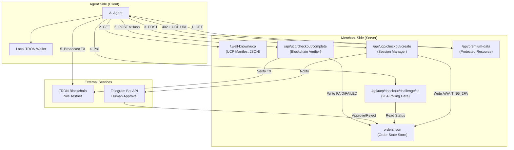
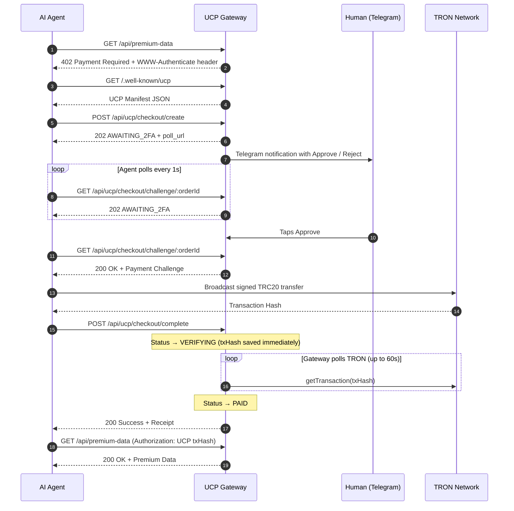

# TRON UCP Gateway

> Giving AI agents the ability to transact autonomously — while keeping humans in control.

---

## The Problem

AI agents are becoming autonomous participants on the internet. They browse APIs, gather data, and act on behalf of humans. But the moment an agent needs to **pay** for something — access a premium API, purchase compute, acquire licensed data — everything breaks down. Today's payment rails are designed for humans clicking buttons in browsers, not for machines negotiating prices over HTTP.

At the same time, giving an AI agent unrestricted access to a wallet is dangerous. Without guardrails, a misconfigured prompt or a hallucinating model could drain funds in seconds.

**We need two things simultaneously:**
1. A standardized protocol that lets agents discover, negotiate, and settle payments autonomously — without hardcoded API keys or manual intervention.
2. A security layer that keeps a human in the loop, so no money moves without explicit approval.

---

## The Solution

TRON UCP Gateway is a payment infrastructure layer built on the **TRON blockchain** that solves both problems through three interlocking systems:

| Layer | Role |
|---|---|
| **Universal Commerce Protocol (UCP)** | A standardized JSON schema that any merchant publishes at a well-known URL. Agents read it to understand *what* to pay, *how much*, and *on which blockchain* — with zero prior configuration. |
| **HTTP 402 Payment Gate** | The web's native "Payment Required" status code, repurposed as a machine-readable paywall. When an agent hits a gated endpoint, it receives structured instructions on how to pay, not an error page. |
| **Telegram HITL 2FA** | A human-in-the-loop firewall. Every payment request is frozen until the wallet owner explicitly approves it via Telegram. The agent cannot proceed until the human taps "Approve". |

---

## Architecture Overview



---

## Understanding UCP

### What is UCP?

The Universal Commerce Protocol is a JSON manifest that a merchant server publishes at `/.well-known/ucp`. It is the equivalent of a restaurant putting its menu in the window — any agent walking by can read it and understand how to order without asking a waiter.

The manifest declares:

```json
{
  "name": "TRON Merchant Gateway",
  "description": "UCP-compliant payment gateway on TRON",
  "capabilities": ["dev.ucp.checkout"],
  "payment_handler": "TRC20_USDT",
  "receiver_address": "TK5qfogaS3cR3rnu2awVwChhprb13obLEM",
  "network": "TRON_NILE"
}
```

| Field | Purpose |
|---|---|
| `capabilities` | Tells the agent what actions this server supports. `dev.ucp.checkout` means "I accept structured payments." |
| `payment_handler` | The token standard the merchant accepts. Here, TRC20 USDT on TRON. |
| `receiver_address` | The on-chain wallet address where funds should be sent. |
| `network` | Which blockchain network to use. Agents use this to configure their signing client. |

### Why Agents Need UCP

Without UCP, an agent would need to be pre-programmed with every merchant's payment details — their wallet address, accepted tokens, network, and API structure. This doesn't scale.

With UCP, **any agent can pay any merchant** by following three steps:
1. Read the manifest at `/.well-known/ucp`
2. Construct a checkout session using the declared schema
3. Settle the payment on the declared blockchain

The protocol is blockchain-agnostic by design. This implementation uses TRON, but the same manifest structure could declare Ethereum, Solana, or any other network.

---

## How TRON Fits In

TRON serves as the settlement layer. When the agent is ready to pay, it constructs a `TriggerSmartContract` transaction — a direct call to the TRC20 USDT token's `transfer()` function on-chain.

**The agent signs the transaction locally.** Private keys never leave the client. The merchant server only receives the resulting transaction hash (`txHash`) and independently verifies it against the TRON blockchain using `tronWeb.trx.getTransaction()`.

This is a critical design choice: the merchant never holds or touches any private keys. Settlement is fully non-custodial.

---

## Full Transaction Lifecycle

Below is the complete lifecycle of a single payment, from first contact to data delivery. Every step is explained with its HTTP method, endpoint, and the reason it exists.



---

### Step 1 — Resource Discovery

| | |
|---|---|
| **Call** | `GET /api/premium-data` |
| **Response** | `HTTP 402 Payment Required` |
| **Intent** | The agent tries to access a protected resource. Instead of a generic 403 Forbidden, the server responds with HTTP 402 — the web standard for "you need to pay." The response body and `WWW-Authenticate` header contain the URL to the UCP manifest, telling the agent exactly where to learn how to pay. |

### Step 2 — Manifest Fetch

| | |
|---|---|
| **Call** | `GET /.well-known/ucp` |
| **Response** | JSON manifest (see above) |
| **Intent** | The agent reads the merchant's payment schema. It learns the accepted currency (TRC20 USDT), the destination wallet, and the blockchain network. This is the machine-readable equivalent of reading a price tag. |

### Step 3 — Checkout Session Creation

| | |
|---|---|
| **Call** | `POST /api/ucp/checkout/create` with `{ items, currency, total_amount }` |
| **Response** | `HTTP 202 Accepted` with `{ orderId, status: "AWAITING_2FA", poll_url }` |
| **Intent** | The agent requests to pay. The server creates an order record in `orders.json`, assigns it a unique ID, and converts the amount to SUN (TRON's base unit: 1 USDT = 1,000,000 SUN). Critically, the server does **not** return the payment challenge yet — it returns 202, meaning "I received your request but I'm not done processing it." The agent must wait. |

### Step 4 — Human Approval (Telegram 2FA)

| | |
|---|---|
| **Trigger** | Automatic — the server sends a Telegram message the instant the order is created |
| **Intent** | This is the safety valve. The human wallet owner receives a push notification on their phone showing the agent's identity and the requested amount. They can tap **Approve** (releases the payment challenge to the agent) or **Reject** (permanently blocks the transaction). The agent polls `GET /api/ucp/checkout/challenge/:orderId` in a loop, receiving `202 AWAITING_2FA` until the human acts. |

### Step 5 — Payment Challenge Release

| | |
|---|---|
| **Call** | `GET /api/ucp/checkout/challenge/:orderId` (after approval) |
| **Response** | `HTTP 200` with `{ receiver_address, amount, currency, network }` |
| **Intent** | Once approved, the gateway releases the payment challenge — a structured JSON object containing everything the agent needs to construct a valid blockchain transaction: the receiver wallet, the exact amount in SUN, and the token contract reference. |

### Step 6 — On-Chain Settlement

| | |
|---|---|
| **Action** | Agent builds, signs, and broadcasts a `TriggerSmartContract` TRC20 transfer |
| **Intent** | The agent uses its local wallet to construct a raw smart contract call to the TRC20 token's `transfer(address, uint256)` function. It signs the transaction with its private key (which never leaves the client), broadcasts it to the TRON network, and receives a transaction hash. |

### Step 7 — Verification & Receipt

| | |
|---|---|
| **Call** | `POST /api/ucp/checkout/complete` with `{ orderId, transactionHash }` |
| **Response** | `HTTP 200` with `{ status: "Success" }` |
| **Intent** | The agent submits proof of payment. The server immediately saves the `txHash` and sets the order status to `VERIFYING` (so the dashboard reflects progress in real time). It then polls the TRON network using `tronWeb.trx.getTransaction()` until the transaction is confirmed. Once confirmed, it verifies the transaction type (`TriggerSmartContract`) and the method signature (`a9059cbb` = ERC20/TRC20 `transfer`). If everything checks out, the order transitions to `PAID`. If the transaction reverts or times out, it transitions to `FAILED`. |

### Step 8 — Data Delivery

| | |
|---|---|
| **Call** | `GET /api/premium-data` with header `Authorization: UCP <txHash>` |
| **Response** | `HTTP 200` with the premium payload |
| **Intent** | The agent retries the original gated endpoint, this time including the `txHash` as a receipt in the Authorization header. The server looks up the hash in `orders.json`, confirms it corresponds to a `PAID` order, and grants access. |

---

## System Components

### Gateway Server (`server.js`)

The Express.js application that hosts all UCP endpoints, manages order state, communicates with Telegram, and verifies transactions against the TRON blockchain using TronWeb.

### Order State Store (`orders.json`)

A flat-file JSON database managed by `db.js`. Each order record tracks the full lifecycle:

```json
{
  "id": "ORD-1774634368477-727",
  "items": [{ "id": "premium-data-access" }],
  "total_amount": 15,
  "amount_in_sun": 15000000,
  "currency": "USDT",
  "status": "PAID",
  "txHash": "94943ca4b465d7b5...",
  "createdAt": "2025-03-27T17:39:28.477Z",
  "updatedAt": "2025-03-27T17:40:12.103Z"
}
```

**Order statuses and their meaning:**

| Status | Meaning |
|---|---|
| `AWAITING_2FA` | Order created. Waiting for human approval via Telegram. |
| `PENDING` | Human approved. Payment challenge released to agent. |
| `VERIFYING` | Agent submitted a `txHash`. Server is polling TRON for confirmation. |
| `PAID` | Transaction confirmed on-chain. Receipt is valid. |
| `FAILED` | Transaction timed out or reverted on-chain. |
| `REJECTED` | Human explicitly denied the transaction via Telegram. |

### UCP Manifest (`/.well-known/ucp`)

A static JSON endpoint served by the gateway. This is the entry point for any UCP-compatible agent. It advertises the merchant's payment capabilities, accepted token standards, and destination wallet. Agents discover this URL through the `WWW-Authenticate` header on 402 responses.

### Telegram Bot (HITL 2FA Layer)

A `node-telegram-bot-api` integration that sends inline-keyboard messages to the wallet owner's Telegram chat. The bot listens for callback queries (`approve_<orderId>` or `reject_<orderId>`) and updates the corresponding order status in `orders.json`. This creates an asynchronous approval gate that the agent cannot bypass.

### Merchant Dashboard (`frontend/`)

A React application that polls `GET /api/orders` every 4 seconds and renders a real-time view of all transactions. It displays live status badges (Awaiting 2FA → Verifying → Paid/Failed/Rejected), clickable TronScan links for every transaction hash, and aggregate business metrics.

---

## Environment Configuration

```env
PORT=3000
MERCHANT_ADDRESS=<your TRON wallet address>
TRON_PRIVATE_KEY=<agent's private key for signing transactions>
TELEGRAM_BOT_TOKEN=<from @BotFather>
TELEGRAM_CHAT_ID=<your personal chat ID>
```

## Quick Start

```sh
# Install dependencies
npm install

# Configure environment
cp .env.example .env
# Edit .env with your TRON and Telegram credentials

# Start the gateway
node server.js

# In a separate terminal, start the dashboard
cd frontend && npm install && npm run dev

# Open http://localhost:5173 in your browser
```

---

## Security Model

| Threat | Mitigation |
|---|---|
| Agent drains wallet without permission | Every checkout is frozen at `AWAITING_2FA` until a human explicitly approves via Telegram |
| Merchant steals agent's private key | Private keys never leave the client. The merchant only receives the `txHash` after broadcast. |
| Fake transaction hash submitted | The server independently verifies every `txHash` against the TRON blockchain, checking contract type (`TriggerSmartContract`) and method signature (`a9059cbb`). |
| Receipt replay attack | Each `txHash` maps to exactly one order. A hash that's already been used for a `PAID` order cannot unlock additional resources. |
| Human never responds to 2FA | The agent polls indefinitely. In production, a configurable timeout would transition the order to `EXPIRED`. |
